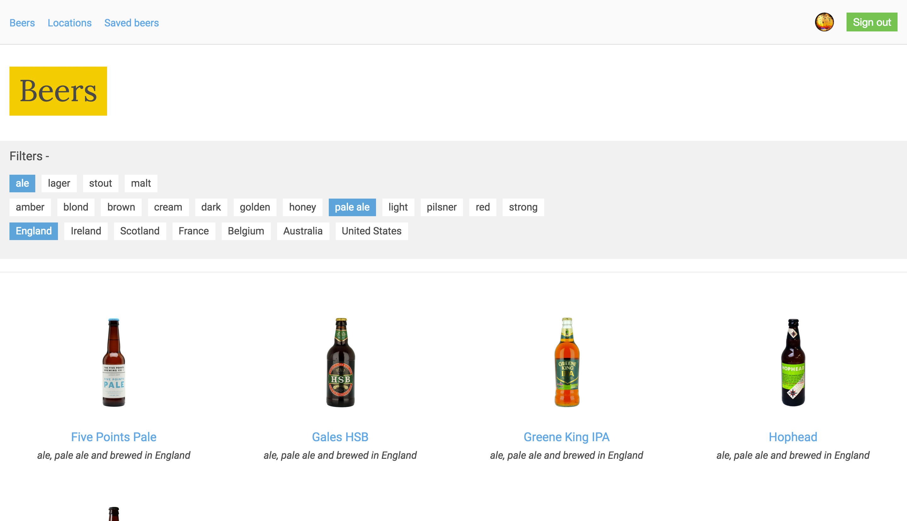
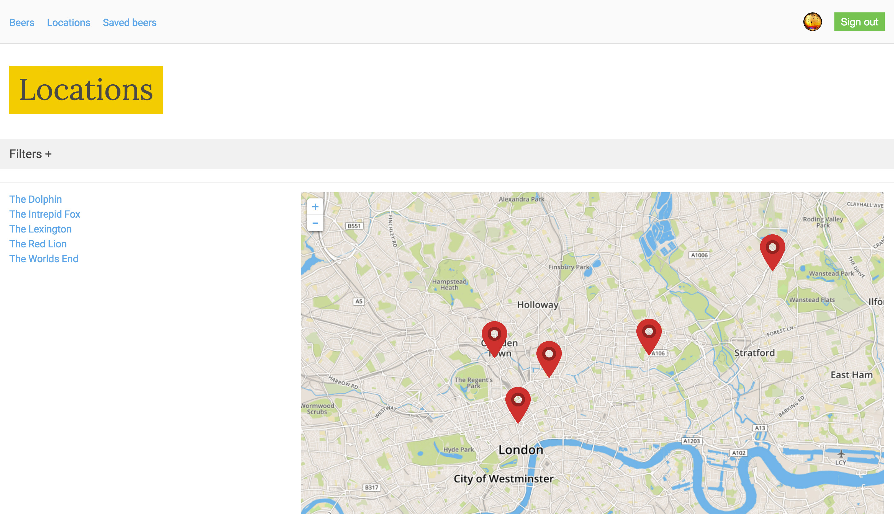

Show me beer
=====================

Show me beer is in progress and by no means finished! It is an app built using React, Redux, Webpack and Firebase that shows you what beers are being sold at pubs in London. All the beers and locations are being served up by Firebase.

You can login using Google authentication and save the beers you like by clicking on the stars next to the beer! This will write your saves to the Firebase DB.

### How to run

1. `git clone` the repo
2. `npm install` to get the node_modules folder
3. `npm start` to initialize the app
4. visit [http://localhost:8080/](http://localhost:8080/)
